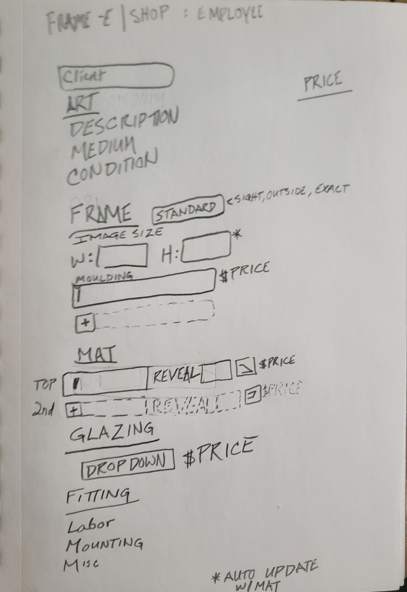
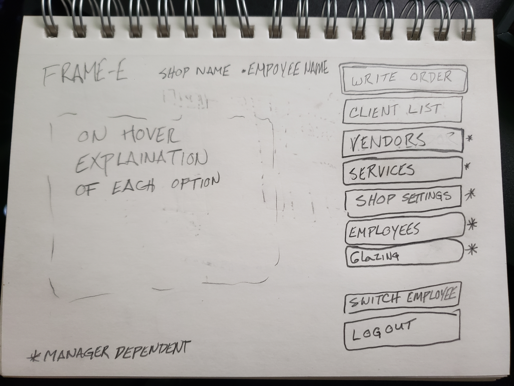
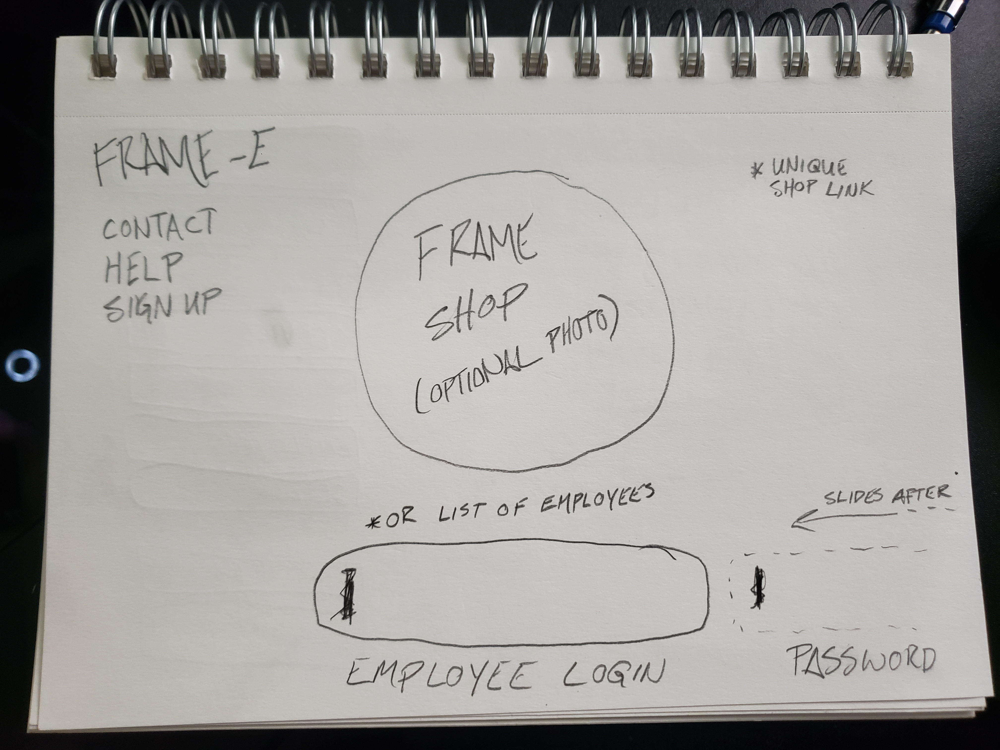
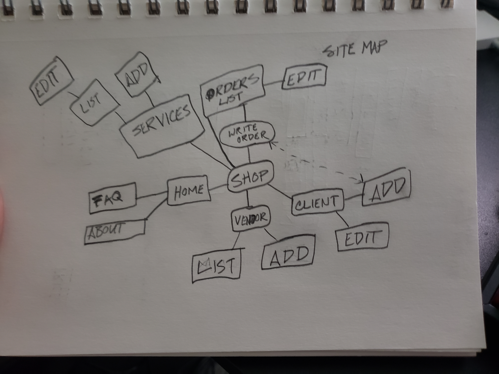

# frame-e
cloud frame order writing software

## Intro
Frame-e will allow frameshops to write orders, track orders, and keep a record of clients all online. 

## ERD
Entity Relationship Diagram shows how all the database connects
[ERD Link](https://lucid.app/lucidchart/388987bd-c1e4-4966-a663-db1cf8c405fb/edit?beaconFlowId=D419958C3FDA3200&page=0_0#?folder_id=home&browser=icon)

## Trello Board
List of user stories, build requirements and icebox items
[Trello](https://trello.com/b/WBzpPrlb/frame-e)

## Major Hurdles
- Affordable hosting
- Vendor Items Data
- Authentication and Licensing
- Multi opening mats
- Dynamic Form reflecting wanted options per shop

## Wire Frames

